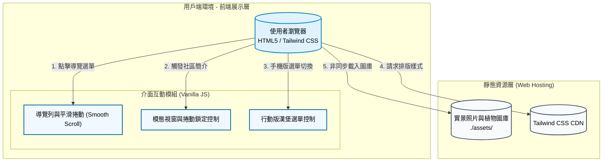

# 碳吉 TanJi 合作示範案例：麗寶萊茵數位生態導覽 🌿

## 1. 專案介紹

### 1.1 系統目的簡介

本系統為「碳吉 TanJi」低碳認證系統之延伸應用示範案例。專為「新北市三峽臺北大學重劃區 - 麗寶萊茵社區」量身打造的**行動端優先 (Mobile-first) 數位生態導覽網頁**。
社區住戶與訪客可透過掃描社區內的 QR Code 進入此網站，以數位化的方式探索社區內的植栽生態、日常節能設備、減碳措施及永續生活設施。此專案不僅取代了傳統紙本佈告欄與實體解說牌的消耗，更作為社區參與低碳認證「創新作為」與「環境教育」的重要數位佐證與推廣媒介。

---

## 2. 系統架構與範圍

### 2.1 系統架構圖

本專案採用 **純靜態網頁 (Static Site) 架構** 設計，極度輕量化，無需依賴任何後端資料庫，確保載入速度與極致的跨裝置相容性。

### 2.2 系統範圍

* **展示層**: 使用 Tailwind CSS 打造現代化視覺，包含毛玻璃導覽列 (Glassmorphism)、互動式植物圖卡、響應式網格佈局 (Grid) 與彈出式模態視窗 (Modal)。
* **內容架構**: 涵蓋五大主題區塊：「生態綠化」、「日常節能設備」、「節能減碳措施」、「永續生活設施」及「未來改造願景」。
* **互動邏輯**: 採用原生 JavaScript 實現錨點平滑捲動、手機版選單開關，以及避免背景穿透捲動的彈窗鎖定機制。

### 2.3 交付項目

1. **網頁應用程式**: 單一 `index.html` 檔案。
2. **靜態圖庫**: `./assets/` 目錄，包含植物圖鑑、設施照片與未來設計示意圖。

---

## 3. 業務功能需求

| 需求編號 | 功能名稱 | 參與者 | 功能描述 | 業務邏輯/備註 |
| --- | --- | --- | --- | --- |
| **FR-01** | **行動導覽與定位** | 住戶/訪客 | 提供毛玻璃質感的吸頂導覽列，支援行動裝置漢堡選單，點擊標籤可平滑捲動 (Smooth Scroll) 至指定區塊。 | 設定 `scroll-margin-top` 確保跳轉時標題不會被導覽列遮擋。 |
| **FR-02** | **生態綠化圖鑑** | 住戶/訪客 | 展示 18 種社區植物（如：鋪地柏、孔雀木、南天竹等），以卡片形式呈現植物照片、學名、科別與環境功能標籤。 | 具備 Hover 圖片微放大特效，增加視覺互動回饋。 |
| **FR-03** | **低碳設備與措施展示** | 住戶/訪客 | 分類展示社區的「節能設備」（如：智慧電錶、感應照明）與「減碳措施」（如：調整契約容量、無紙化區權會）。 | 結合圖示與重點條列，將生硬的管理規約轉化為易讀的數位文宣。 |
| **FR-04** | **永續生活與未來願景** | 住戶/訪客 | 介紹雨水回收、電動車友善管線、幸福小站等設施，並展示「屋頂農園」之未來 3D 模擬願景圖。 | 強化社區居民對綠色生活的認同感與期待。 |
| **FR-05** | **社區簡介彈窗** | 訪客 | 透過右下角浮動按鈕（FAB）開啟社區理念介紹彈窗，說明麗寶萊茵與龍埔國小的生態教育結合願景。 | 開啟彈窗時觸發 `body.style.overflow = 'hidden'` 鎖定背景捲動。 |

---

## 4. 非業務功能需求

### 4.1 安全性與隱私

* **免蒐集個資**: 本系統純為單向資訊展示平台，無任何輸入表單、無後端資料庫連線，不追蹤或蒐集任何使用者個人隱私數據。
* **靜態安全**: 無法執行 SQL Injection 或 XSS 攻擊，安全性極高。

### 4.2 系統效能

* **輕量化與快速渲染**: 不使用 React/Vue 等重型框架，直接依賴瀏覽器原生 DOM 渲染；配合 CDN 載入 CSS，確保在戶外使用行動網路掃描 QR Code 時能瞬間秒開。
* **優雅降級 (Graceful Degradation)**: 圖片設定了完善的 `onerror` 處理機制，若本地端 `assets/` 圖片遺失，會自動無縫替換為 Unsplash 線上備用圖庫。

### 4.3 可用性與設計規範

* **無障礙閱讀**: 採用易讀的 `Noto Sans TC` 字體，並配以柔和的 Slate (灰藍) 與 Brand (品牌藍) 色系，降低戶外強光下的閱讀疲勞。
* **防誤觸設計**: 針對行動裝置加入 `-webkit-tap-highlight-color: transparent`，消除點擊時的預設閃爍，提升類似原生 App 的操作手感。

---

## 5. 系統介面設計

### 5.1 視覺主題設定 (Tailwind Config)

系統透過 Tailwind CSS 的自訂擴充，建立了專屬的品牌色系與間距：

* **品牌主色 (Brand)**:
* Light: `#E0F2FE` (柔和天藍)
* DEFAULT: `#0EA5E9` (科技亮藍)
* Dark: `#0369A1` (沉穩深藍)

* **導覽列高度緩衝**: 設定 `scrollMargin: {'header': '90px'}`，確保錨點跳轉的精準視覺定位。

### 5.2 互動元件 (CSS Animations)

* **卡片懸停 (Hover)**: 利用 `.group:hover .img-container img` 實作順滑的縮放過場 (`transform: scale(1.05)`)。
* **彈窗過場 (Modal)**: 實作 `.modal` 的透明度漸變 (`opacity`) 與縮放 (`transform: scale(0.95)` to `1`) 的雙重過場效果，使進出場更自然柔和。

---

## 6. 安裝與部署

### 前置需求

* 現代瀏覽器（Google Chrome, Safari, iOS Safari, Edge）。
* 準備好對應的 `./assets/` 圖庫資源（若無，系統將自動套用備用圖片）。

### 部署步驟

1. **取得原始碼**: 獲取專案的 `index.html`。
2. **配置靜態資源**:
將植物照片與設施照片放入相對應的目錄中：
* `assets/logo/`
* `assets/plants/`
* `assets/facilities/`
* `assets/measures/`
* `assets/future/`

3. **雲端託管**:
將整包檔案上傳至任何支援靜態網頁託管的服務，例如：
* **GitHub Pages**
* **Vercel** / **Netlify**
* **AWS S3** / **Cloudflare Pages**

4. **生成 QR Code**: 將部署後的網站 URL 轉換為 QR Code，張貼於社區大廳、電梯或中庭花園，供住戶與訪客隨時掃描瀏覽。
